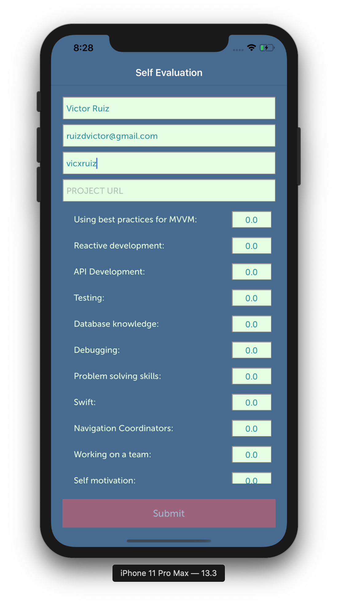

# SelfEvaluation

      

## Project Overview

"Self Evaluation" is an iOS project that allows for interview candidates to quickly and efficiently submit self evaluations to hiring managers.

# Project development tools

Xcode 10.1
Package management tool

[CocoaPods 1.5.3] (https://cocoapods.org/)

# The Code Structure

MVVM

### Key Features

- Candidate can easily send self-evaluation to hiring manager via email 

